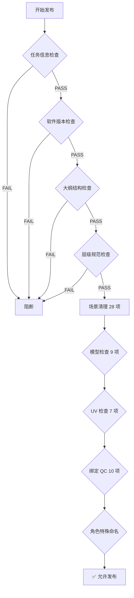

# YSJ 项目 Maya 文件规范

> 推导来源：`config/ysj_config.json` + `config/pipeline_manifest.json` + `app/_maya/qc/` 全量代码审计
> 适用版本：Maya 2025 | Redshift（版本由 QC 动态校验）
> 项目代号：`ysj`
> 服务器根路径：`X:/Project/ysj`

---

## 一、文件命名规范

### 1.1 资产文件命名

```
{project}_{category}_{asset}_{stage}_{task}_v{version}.ma
```

| 字段 | 取值范围 | 示例 |
|---|---|---|
| `project` | `ysj` | — |
| `category` | `chr` / `prp` / `env` | — |
| `asset` | 资产名（驼峰式，如 `yjTie`） | — |
| `stage` | 见 §1.3 | — |
| `task` | 见 §1.3 | — |
| `version` | 三位数字，零填充 | `001`, `007` |

**示例**：`ysj_chr_yjTie_tex_texMaster_v007.ma`

### 1.2 镜头文件命名

```
{project}_{sequence}_{shot}_{stage}_{task}_v{version}.ma
```

**示例**：`ysj_sc01_cam001_ani_aniMaster_v003.ma`

### 1.3 阶段与任务速查表

#### 资产阶段

| 阶段 | 主任务 | 子任务 | 适用类别 |
|---|---|---|---|
| `mod` | `modMaster` | — | chr / prp / env |
| `lybg` | `lybgMaster` | — | prp / env |
| `uv` | `uvMaster` | — | chr / prp / env |
| `tex` | `texMaster` | `paintTex` `refinement` `fur` `basicTex` | chr / prp / env |
| `lyrig` | `lyrigMaster` | — | chr |
| `rig` | `rigMaster` | `bs` `facialTex` `assetCfx` `proxyRig` | chr / prp |
| `lib` | `libMaster` | `libRig` `lightMap` | chr / prp / env |

#### 镜头阶段

| 阶段 | 主任务 | 子任务 |
|---|---|---|
| `ly` | `lyMaster` | — |
| `ani` | `aniMaster` | — |
| `cfx` | `cfxMaster` | — |
| `efx` | `efxMaster` | `efxTex` |
| `efx2d` | `efx2dMaster` | `efx2dSource` |
| `lgt` | `lgtMaster` | `set` |
| `mat` | `ui` | `mp` `mpSource` `shotAsset` |

---

## 二、服务器路径结构

### 2.1 资产路径

```
X:/Project/ysj/pub/assets/{category}/{asset}/{stage}/{task}/
```

| 路径根 | 用途 |
|---|---|
| `pub/assets` | 资产发布目录（chr / prp / env） |
| `pub/asset_lib` | lib 阶段入库目录（`path_root_override`） |
| `sourceimages` | 贴图源文件 |
| `pub/efx/efx_asset` | 资产特效（assetCfx 子任务） |
| `assets` | 工作区（paintTex / bs 等子任务） |

### 2.2 镜头路径

```
X:/Project/ysj/pub/shots/{sequence}/{shot}/{stage}/{task}/
```

### 2.3 受保护路径（只读，禁止 AI 写入）

| 路径 | 说明 |
|---|---|
| `X:/Project/` | 服务器盘符 |
| `//server/` | UNC 路径 |
| `\\server\` | Windows UNC |

> 所有 AI 写入必须落入 `runs/` 或任务沙盒

---

## 三、场景大纲（Outliner）结构规范

### 3.1 chr / prp 类型 — 资产阶段（mod / uv / tex）

```
|Group                          ← 唯一顶层组
└── cache                       ← 几何根组（geom_roots: |Group|cache）
    ├── {asset}_body1           ← 模型物体（前缀必须统一为资产名）
    ├── {asset}_head1
    ├── {asset}_L_eyeball1      ← 眼球（chr 特殊命名）
    ├── {asset}_R_eyeball1
    ├── {asset}_L_vitreous1     ← 高光附着面（chr 特殊命名）
    ├── {asset}_R_vitreous1
    ├── {asset}_L_eyeshadow1    ← 眼睛阴影（chr 特殊命名）
    ├── {asset}_R_eyeshadow1
    └── {asset}_line*           ← 描线模型（chr 特殊命名）
```

**允许的额外顶层节点**（仅 chr/prp）：
- `{asset}_hair_Grp` — 毛发组
- `{asset}_fur_Grp` — 毛皮组
- `{asset}_refmod_Grp` — 参考模型组

**禁止**：四个默认相机（persp/top/front/side）以外的任何其他顶层节点

### 3.2 chr / prp 类型 — 绑定阶段（rig / lyrig / lib）

```
|Group                          ← 唯一顶层组
├── MotionSystem               ← 控制器根（ctrl_root: |*|MotionSystem）
├── DeformationSystem          ← 变形根（deform_root: |*|DeformationSystem）
└── Geometry
    ├── cache                   ← 几何根组（geom_roots: |Group|Geometry|cache）
    │   ├── {asset}_body1
    │   └── ...
    └── data                    ← 数据组（必须存在）
```

### 3.3 env 类型

```
|BG                             ← 或 |Group（兼容两种）
├── mesh                        ← 模型组
│   ├── {asset}_terrain         ← 地形
│   ├── {asset}_building        ← 建筑
│   ├── {asset}_vegetation      ← 植被
│   └── {asset}_prop            ← 道具
└── adjunction                  ← 附加组
    ├── {asset}_efx_cache       ← 特效缓存
    ├── {asset}_proxy           ← 代理
    ├── {asset}_fluid           ← 流体
    ├── {asset}_distributed     ← 分布
    ├── {asset}_hair            ← 毛发
    ├── {asset}_light           ← 灯光
    │   ├── key_light
    │   ├── fill_light
    │   └── environment_light
    ├── {asset}_camera          ← 相机
    ├── {asset}_model           ← 模型
    └── {asset}_fog             ← 雾
```

### 3.4 ani 镜头文件

```
|ani_grp                        ← 动画主组
│   └── cam_grp                 ← 相机组（必须存在）
|bg_grp                         ← 背景组
|OTHER                          ← 其他组
```

**允许的额外节点**：`efx`, `mask_group`, `zshotmask`

---

## 四、物体命名规范

### 4.1 前缀规则

> **来源**：`qc/mod/pre_fix_name.py`

所有 `cache` 组下的物体必须使用统一前缀 = **资产名**

```
{asset}_{descriptor}[{side}]{index}
```

| 示例 | 说明 |
|---|---|
| `yjTie_body1` | 身体 |
| `yjTie_L_eyeball1` | 左眼球 |
| `yjTie_hair_001` | 毛发 |

**检查范围**：`cache` + `{asset}_hiddenMesh_Grp` + `{asset}_staticCurve_Grp` + `{asset}_hair_Grp` + `{asset}_fur_Grp` + `{asset}_refmod_Grp`

**豁免**：env 类型跳过前缀检查

### 4.2 禁止的默认名称

> **来源**：`qc/mod/default_name.py`

以下正则模式匹配的名称**禁止入库**：

| 模式 | 示例 |
|---|---|
| `pCube\d+` | pCube1 |
| `pSphere\d+` | pSphere3 |
| `pCylinder\d+` | pCylinder1 |
| `pTorus\d+` | pTorus1 |
| `pPlane\d+` | pPlane2 |
| `pCone\d+` | pCone1 |
| `nurbsCircle\d+` | nurbsCircle1 |
| `curve\d+` | curve1 |
| `nurbsSphere\d+` | nurbsSphere1 |
| `group\d+` | group5 |
| `camera\d+` | camera1 |
| `polySurface\d+` | polySurface10 |
| `null\d+` | null1 |
| `locator\d+` | locator2 |
| `joint\d+` | joint15 |
| `transform\d+` | transform3 |
| `ikHandle\d+` | ikHandle1 |

### 4.3 chr 特殊部件命名（必须存在）

> **来源**：`qc/check/chr_special_name.py` | 仅 `chr` 类型触发

| 部件 | 命名规则 | 必须节点 |
|---|---|---|
| 眼球 | `{asset}_{side}_eyeball1` | `{asset}_L_eyeball1` + `{asset}_R_eyeball1` |
| 高光附着面 | `{asset}_{side}_vitreous1` | `{asset}_L_vitreous1` + `{asset}_R_vitreous1` |
| 眼睛阴影 | `{asset}_{side}_eyeshadow1` | `{asset}_L_eyeshadow1` + `{asset}_R_eyeshadow1` |
| 描线 | `{asset}_line*` | 至少存在一个匹配物体 |

### 4.4 Shape 节点命名规范

> **来源**：`qc/mod/mutil_shape.py` + `qc/rig/rig_rename_shape.py` + `qc/rig/fix_orig_shape.py`

| 规则 | 标准格式 | 说明 |
|---|---|---|
| 标准 Shape | `{transform}Shape` | 每个 transform 下只允许一个非中间体 mesh shape |
| Orig Shape | `{transform}ShapeOrig` | 绑定物体的原始形（仅 rig/lib 允许） |
| 不允许多 Shape | — | 多个非 intermediate shape 触发 error |

---

## 五、几何数据规范

### 5.1 变换（Transform）冻结规则

> **来源**：`qc/mod/freeze_mesh.py`

| 属性 | 要求 | 容差 |
|---|---|---|
| Translate X/Y/Z | = 0 | ±0.01 |
| Rotate X/Y/Z | = 0 | ±0.01 |
| Scale X/Y/Z | = 1 | ±0.01 |

**豁免**：投射相机、流体 Shape、灯光节点、GPU 缓存、`hightLightPointGrp` 组

### 5.2 cache 组通道检查（rig 阶段）

> **来源**：`qc/rig/cache_channel.py`

rig 阶段的 cache 组下物体必须满足：
- `translate` = (0, 0, 0)
- `rotate` = (0, 0, 0)
- `scale` = (1, 1, 1)

### 5.3 法线方向

> **来源**：`qc/mod/conform_mesh.py`

发布前必须统一法线方向：`polyNormal(normalMode=2, userNormalMode=0, ch=0)`

### 5.4 Orig 节点规则（按阶段）

> **来源**：`config/ysj_config.json` stages.rules

| 阶段 | require_orig | allow_orig | 违规级别 |
|---|---|---|---|
| mod | ❌ | ❌ | ERROR（若 orig 存在） |
| uv | ❌ | ❌ | ERROR（若 orig 存在） |
| tex | ❌ | ❌ | ERROR（若 orig 存在） |
| lyrig | — | ✅ | — |
| rig | ✅ | ✅ | WARNING（若 orig 缺失） |
| lib | — | ✅ | — |

---

## 六、UV 规范

> **来源**：`qc/uv/` 全部 7 项检查

### 6.1 UV Set 规则

| 规则 | 说明 | 级别 |
|---|---|---|
| 唯一 UV Set | 只允许一个 UV Set | error |
| 命名为 `map1` | 当前活动 UV Set 必须是 `map1` | error |
| 名称正确 | UV Set 名称必须为 `map1`（`PencilSelectedEdge*` 豁免） | error |

### 6.2 UV 空间规则

| 规则 | 说明 | 级别 |
|---|---|---|
| 禁止负空间 | UV 坐标不允许 U < 0 或 V < 0 | error |
| 禁止跨象限 | 单个面的 UV 不允许跨越 UDIM 象限边界 | error |
| 禁止反向 | UV 面不允许翻转（winding order 反向） | error（可自动修复） |
| 避免自重叠 | 同一 UV Set 内不允许 UV 面重叠 | ⚠️ warning |

---

## 七、材质规范

### 7.1 资产阶段

| 规则 | 说明 |
|---|---|
| 禁止使用 `lambert1` | 任何 mesh 不得赋予默认 lambert1 材质 |
| 无用材质清理 | 发布前执行 `deleteUnusedNodes`，清除无连接材质球 |

### 7.2 绑定阶段

> **来源**：`qc/rig/rig_material.py`

- 绑定文件内贴图路径必须合法
- 贴图信息必须与 tex 阶段发布数据一致

### 7.3 贴图路径格式

> **来源**：`qc/rig/analyse_scene_materials.py`

| 节点类型 | 路径属性 | UDIM 支持 |
|---|---|---|
| `file` | `fileTextureName` | ✅（`uvTilingMode` > 0） |
| `RedshiftNormalMap` | `tex0` | — |
| `RedshiftSprite` | `tex0` | — |

贴图路径中以 `sourceimages/` 或 `cache/` 开头的会自动补全项目前缀

---

## 八、场景清洁度规范

> **来源**：`qc/clean/` 全部 28 项清理

### 8.1 必须清理的内容

| 类别 | 禁止存在的节点 |
|---|---|
| 动画数据 | 非驱动关键帧的 `animCurve`、所有 `animLayer` |
| 显示/渲染层 | 非 `defaultLayer` 的显示层、非 `defaultRenderLayer` 的渲染层 |
| 灯光 | `defaultLightSet` 中的灯光、`lightEditor` 节点、环境光节点 |
| 相机 | 非默认四视图 + 非投射相机的多余相机 |
| 约束/表达式 | 无下游连接的约束（9 种类型）、无下游连接的表达式 |
| 未知节点 | 所有 `type='unknown'` 节点、未知插件注册 |
| 引用 | `referenceQuery` 失败的无效引用 |
| 安全 | 所有 `script` 节点（保留 `MakeTSM3ControlsMenu`）、恶意 scriptJob |
| 数据膨胀 | `blindDataTemplate`、`polyBlindData`、`dataStructure`、`pointOnCurveInfo` |
| 渲染 | 所有 `aiAOV` + `RedshiftAOV` 节点、Turtle `ilrBakeLayer` |
| 命名空间 | 所有自定义命名空间（保留 `:UI` 和 `:shared`） |
| 空组 | 无子节点且无有效连接的 transform 组 |
| 空 Sets | 空的 objectSet（保留 4 个系统级 set） |
| Shader | 无用材质球 |

### 8.2 ly/ani 阶段豁免

| 豁免项 | 说明 |
|---|---|
| `hide` 显示层 | ly/ani 阶段保留名为 `hide` 的显示层 |

---

## 九、绑定（Rig）专项规范

### 9.1 vis_data 节点

> **来源**：`qc/rig/vis_data_check.py` + `vis_data_attrs.py`

- rig 文件内**必须存在** `vis_data` 节点（存储模型显隐动画信息）
- `vis_data` 节点属性名必须与 cache 组下 mesh 名一一对应

### 9.2 蒙皮数据

| 规则 | 说明 |
|---|---|
| 蒙皮必须存在 | rig 阶段 `require_skin: true` |
| 清理无用 skinCluster | 删除无连接的 `skinCluster` 变形器 |
| Orig 节点必须存在 | rig 阶段 `require_orig: true`（缺失为 WARNING） |

### 9.3 Tex → Rig 一致性检查

> **来源**：`qc/rig/check_tex_mesh_info.py`

rig 文件发布前必须与 tex 阶段的 mesh 信息进行对比，检测：
- 顶点数变化
- 面数变化
- 材质信息变化

---

## 十、环境检查

### 10.1 任务信息

> **来源**：`qc/check/task_infos.py`

文件内必须嵌入有效的任务信息（通过 `ppas.app._maya.util.get_task_info()` 读取），缺失则**阻断发布**

### 10.2 软件版本

> **来源**：`qc/check/maya_version.py` + `qc/check/redshift_version.py`

| 检查项 | 说明 |
|---|---|
| Maya 版本 | 必须与项目配置的指定版本一致 |
| Redshift 版本 | 必须加载 `redshift4maya` 插件且版本匹配 |

---

## 十一、Rig 同步算法参数（自动化管线）

> **来源**：`config/ysj_config.json` → `rig_sync_profile`

### 11.1 配对参数

| 参数 | 值 | 说明 |
|---|---|---|
| `enable_cpd` | `true` | 启用 CPD 点云配准 |
| `cpd_point_diff_threshold` | `0.8` | 顶点数差异超过 80% 禁止 CPD |
| `chamfer_threshold` | `5.0` cm | Chamfer 距离阈值 |
| `bbox_iou_min` | `0.01` | 包围盒 IoU 最低阈值 |
| `auto_approve_threshold` | `0.95` | 95% 以上自动通过 |
| `review_threshold` | `0.80` | 80-95% 需人工审核 |

### 11.2 精度参数

| 参数 | 值 | 说明 |
|---|---|---|
| `precision_exact` | `0.0001` cm | 完全匹配精度 |
| `precision_loose` | `0.005` cm | 宽松匹配精度 |
| `partial_match_min_pct` | `0.99` | 部分匹配最低 99% |

### 11.3 投射参数

| 参数 | 值 | 说明 |
|---|---|---|
| `max_normal_angle_deg` | `90°` | 法线最大角度 |
| `k_candidates` | `8` | KNN 候选数 |
| `bary_outgrow` | `0.1` | 重心坐标外扩容差 |

---

## 附录 A：QC 执行矩阵（阶段 × 检查类别）

| 检查类别 | mod | uv | tex | lyrig | rig | lib | ly | ani |
|---|---|---|---|---|---|---|---|---|
| 任务信息检查 | ✅ | ✅ | ✅ | ✅ | ✅ | ✅ | ✅ | ✅ |
| 软件版本检查 | ✅ | ✅ | ✅ | ✅ | ✅ | ✅ | ✅ | ✅ |
| 大纲结构检查 | ✅ | ✅ | ✅ | ✅ | ✅ | ✅ | — | ✅ |
| 层级规范检查 | ✅ | ✅ | ✅ | ✅ | ✅ | ✅ | — | ✅ |
| 场景清理 28 项 | ✅ | ✅ | ✅ | ✅ | ✅ | ✅ | ⚠️ | ⚠️ |
| 模型检查 9 项 | ✅ | ✅ | — | — | — | — | — | — |
| UV 检查 7 项 | — | ✅ | ✅ | — | — | — | — | — |
| chr 特殊命名 | ✅ | ✅ | ✅ | — | — | — | — | — |
| 绑定 QC 10 项 | — | — | — | ✅ | ✅ | ✅ | — | — |

---

## 附录 B：发布流程检查清单



> 每个阶段仅执行适用的检查项（见附录 A）
